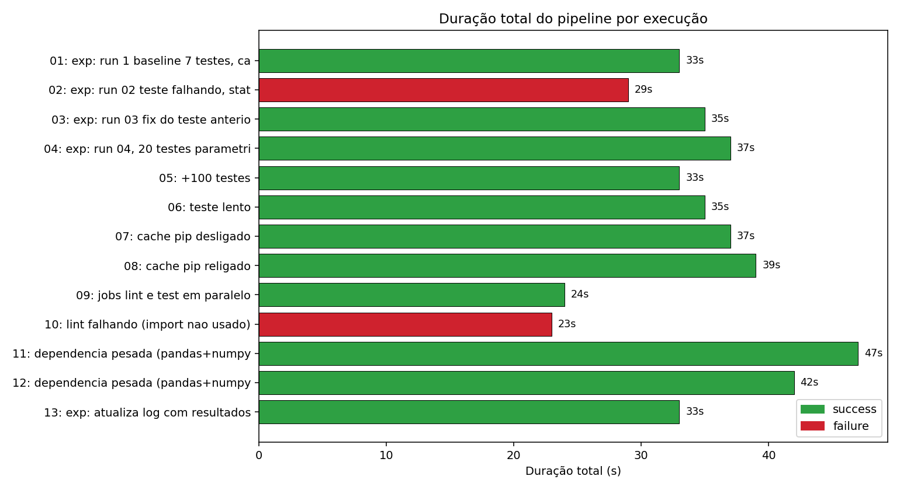
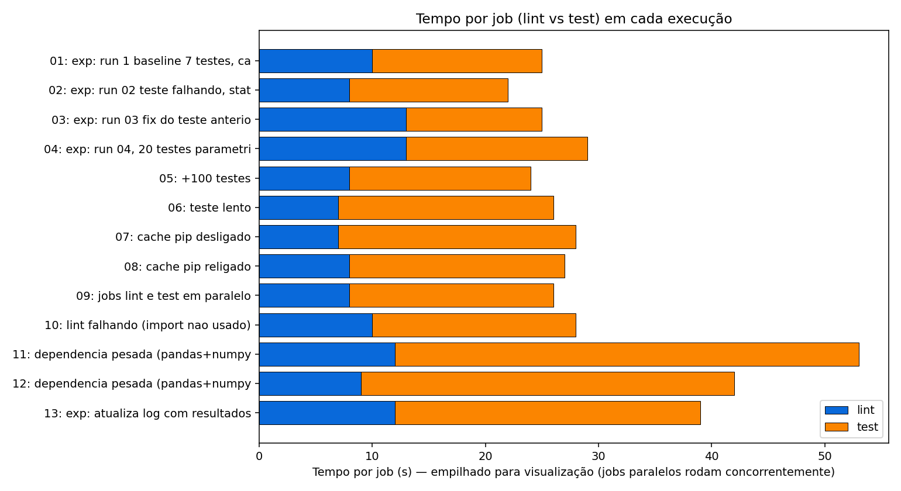
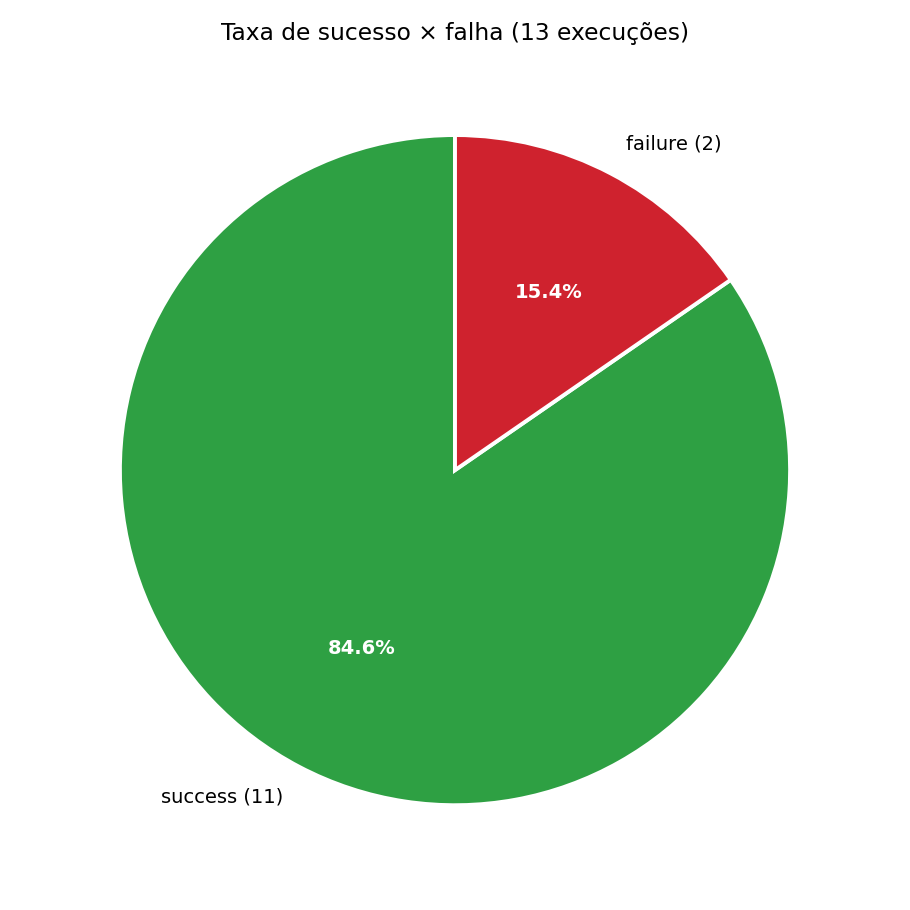
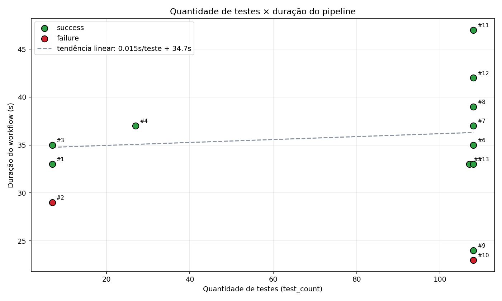
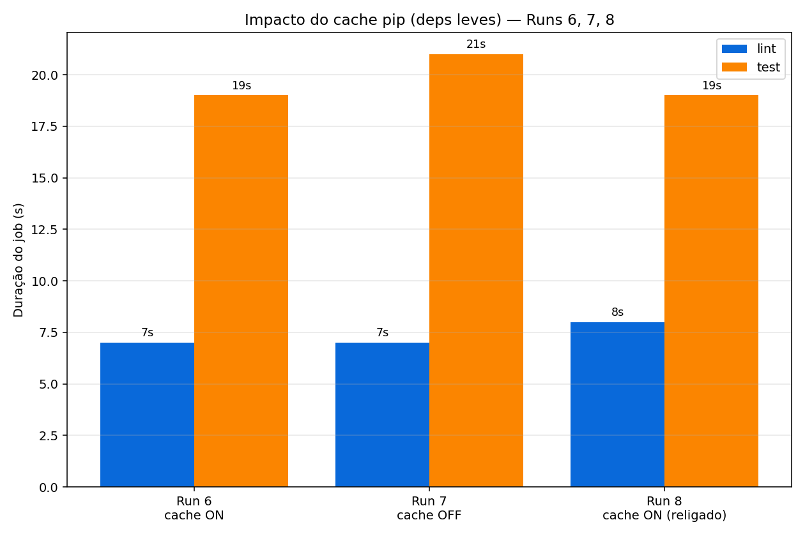
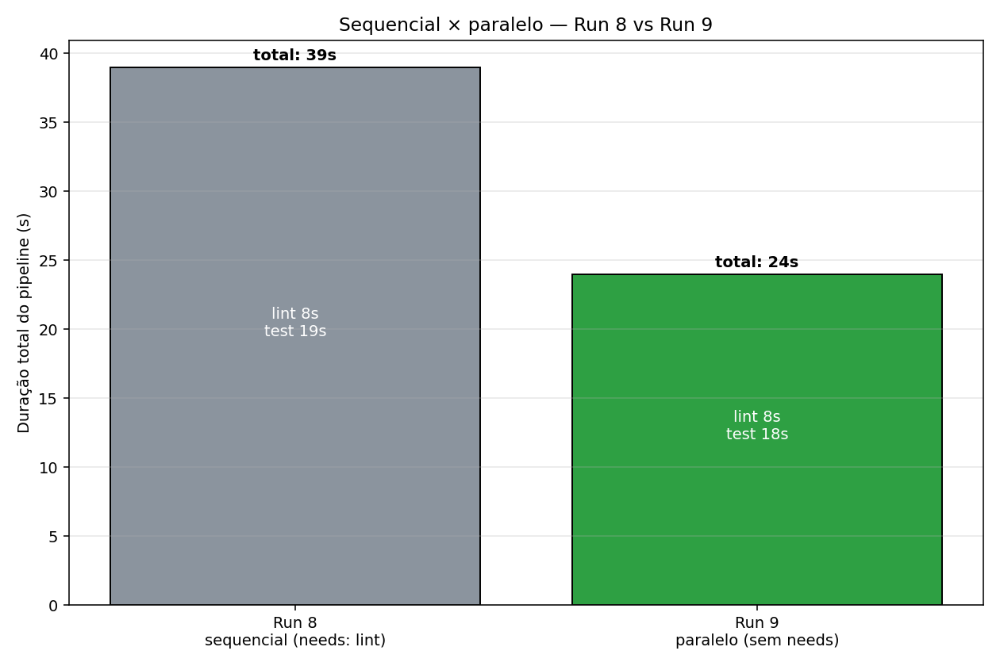
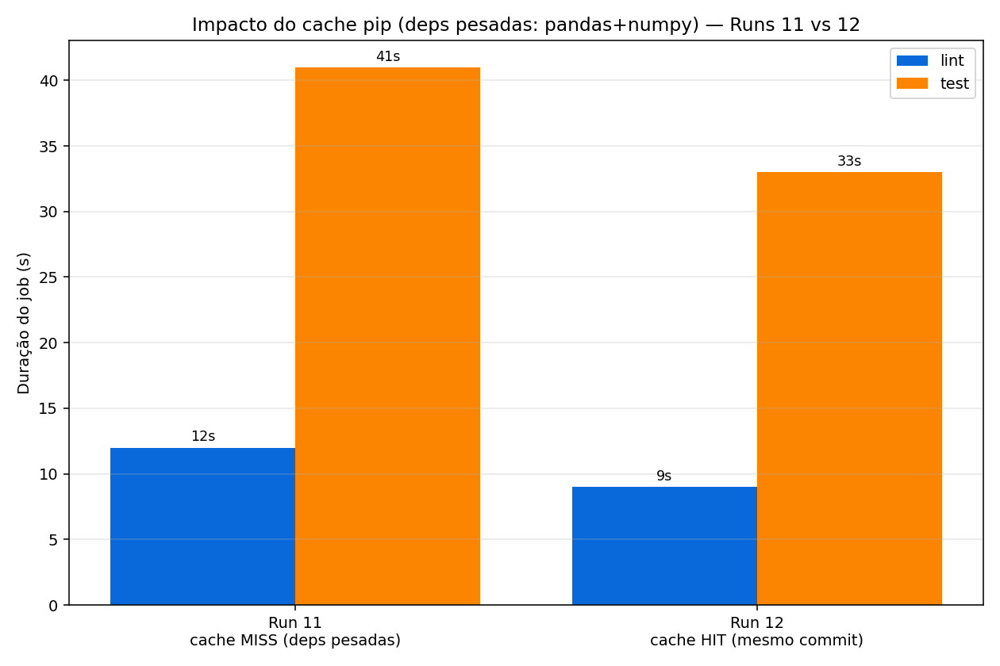

# Experimento CI/CD GitHub Actions — Ponderada S7M10

Workflow YAML: <https://github.com/Renan-Coding/pond-s7m10-cicd/blob/main/.github/workflows/ci.yml>
Actions (runs): <https://github.com/Renan-Coding/pond-s7m10-cicd/actions>

## 1. Resumo

Instrumentei um pipeline GitHub Actions de uma mini TODO API em FastAPI, executei 13 runs com variações controladas e coletei métricas via API do GitHub.

1. Paralelizar `lint` e `test` cortou a duração total em 38 % (39s para 24s) — alavanca de maior impacto.
2. Cache pip depende da stack: para deps leves (fastapi+sqlalchemy+pytest+ruff) economia foi 2s (irrelevante); para deps pesadas (pandas+numpy) o ganho subiu para 8s.
3. Duração do pipeline NÃO escala com quantidade de testes quando cada teste é trivial.

## 2. Passo a passo

### 2.1 — Pré-requisitos

- Python 3.11+ (testado em 3.11)
- `git`
- Conta GitHub
- (Opcional, mas recomendo) [`uv`](https://github.com/astral-sh/uv) para gerenciar venv mais rápido

### 2.2 — Clonar e validar o app localmente

```bash
git clone https://github.com/Renan-Coding/pond-s7m10-cicd
cd pond-s7m10-cicd

python3.11 -m venv .venv && source .venv/bin/activate
pip install -r requirements.txt -r requirements-dev.txt

pytest                # deve passar (7 a 108 testes dependendo do checkout)
ruff check app tests  # deve passar sem violações
```

### 2.3 — Configurar token GitHub (para coletar métricas via API)

1. Gerar token fine-grained em <https://github.com/settings/personal-access-tokens/new>:
   - Repository access: Only select repositories -> `pond-s7m10-cicd`
   - Permissions -> Repository:
     - `Actions`: Read-only
     - `Contents`: Read-only
2. Copiar o token gerado (`github_pat_...`)
3. Criar `.env` local
4. Colar o token

```bash
cp .env.example .env
# editar .env e preencher GITHUB_TOKEN=github_pat_...
```

Conteúdo final do `.env`:

```
GITHUB_TOKEN=github_pat_XXXXXXXX
GITHUB_REPO=Renan-Coding/pond-s7m10-cicd
GITHUB_WORKFLOW=ci.yml
```

### 2.4 — Rodar a coleta + gerar gráficos

```bash
pip install -r scripts/requirements.txt
python scripts/collect_metrics.py --env .env --out data/
python scripts/plot.py --summary data/runs_summary.csv --long data/runs_long.csv --out prints/
```

Saída esperada:

- `data/runs_long.csv`
- `data/runs_summary.csv`
- `data/raw/run_*.json`
- `prints/1_duracao_pipeline.png`...`7_impacto_cache_pesado.png` — gráficos

### 2.5 — Validar resultados

```bash
ls data/       # CSVs + raw/
ls prints/     # png dos gráficos + jpeg das runs
head -5 data/runs_long.csv
cat data/runs_summary.csv
```

## 3. Estrutura do projeto

```
.
├── .github/workflows/ci.yml   # pipeline CI (jobs lint + test)
├── app/                       # FastAPI TODO API (projeto exemplo)
│   ├── main.py                # endpoints CRUD
│   ├── models.py              # SQLAlchemy
│   ├── schemas.py             # Pydantic
│   └── database.py            # sessão SQLite
├── tests/                     # pytest
│   ├── conftest.py
│   ├── test_tasks.py
│   └── test_bulk.py
├── scripts/                   # coleta e visualização
│   ├── collect_metrics.py     # consulta API GitHub
│   ├── plot.py                # gera os gráficos
│   └── requirements.txt
├── data/                      # saída do coletor
│   ├── runs_long.csv          # formato exigido
│   ├── runs_summary.csv       # formato wide
│   └── raw/run_*.json         # dumps crus
├── prints/                    # gráficos + screenshots
├── experiment-log.md          # log detalhado das 12+ runs
├── requirements.txt           # deps do app (fastapi, sqlalchemy, pydantic)
├── requirements-dev.txt       # pytest, httpx, ruff
├── ruff.toml                  # config lint
├── pytest.ini
└── README.md
```

## 4. Pipeline GitHub Actions

Workflow: [`ci.yml`](.github/workflows/ci.yml).

2 jobs no `ubuntu-latest`:

- `lint`: `actions/setup-python@v5` (com `cache: pip`) -> `pip install -r requirements-dev.txt` -> `ruff check app tests`
- `test`: igual + `pip install -r requirements.txt -r requirements-dev.txt` -> `pytest --junitxml=report.xml` -> `actions/upload-artifact@v4`

Trigger: `push` e `workflow_dispatch`. O `--junitxml` produz XML que o coletor parseia para extrair `test_count`, `test_failures` e tempo médio.

## 5. Tabela de execuções (13 runs)

| # | run_id | commit | descrição | status | total | lint | test | testes |
|---|--------|--------|-----------|--------|-------|------|------|--------|
| 1 | [26889692930](https://github.com/Renan-Coding/pond-s7m10-cicd/actions/runs/26889692930) | `c16deeb` | baseline (7 testes, cache on, sequencial) | ✅ | 33s | 10s | 15s | 7 |
| 2 | [26890173516](https://github.com/Renan-Coding/pond-s7m10-cicd/actions/runs/26890173516) | `4e759e3` | teste falhando (status code errado) | ❌ | 29s | 8s | 14s | 7 (1 ❌) |
| 3 | [26890350804](https://github.com/Renan-Coding/pond-s7m10-cicd/actions/runs/26890350804) | `4f61d57` | fix do teste anterior | ✅ | 35s | 13s | 12s | 7 |
| 4 | [26890470856](https://github.com/Renan-Coding/pond-s7m10-cicd/actions/runs/26890470856) | `105e85f` | +20 testes parametrizados | ✅ | 37s | 13s | 16s | 27 |
| 5 | [26890700597](https://github.com/Renan-Coding/pond-s7m10-cicd/actions/runs/26890700597) | `2a3598b` | +100 testes | ✅ | 33s | 8s | 16s | 107 |
| 6 | [26890917608](https://github.com/Renan-Coding/pond-s7m10-cicd/actions/runs/26890917608) | `ae3b503` | teste lento (sleep 5s) | ✅ | 35s | 7s | 19s | 108 |
| 7 | [26891429817](https://github.com/Renan-Coding/pond-s7m10-cicd/actions/runs/26891429817) | `b5a78d8` | cache pip desligado | ✅ | 37s | 7s | 21s | 108 |
| 8 | [26891585287](https://github.com/Renan-Coding/pond-s7m10-cicd/actions/runs/26891585287) | `d52df13` | cache pip religado | ✅ | 39s | 8s | 19s | 108 |
| 9 | [26891782877](https://github.com/Renan-Coding/pond-s7m10-cicd/actions/runs/26891782877) | `667228b` | jobs lint e test em paralelo | ✅ | 24s | 8s | 18s | 108 |
| 10 | [26891901602](https://github.com/Renan-Coding/pond-s7m10-cicd/actions/runs/26891901602) | `d455ce7` | lint falhando (F401) | ❌ | 23s | 10s | 18s | 108 |
| 11 | [26892051006](https://github.com/Renan-Coding/pond-s7m10-cicd/actions/runs/26892051006) | `84c53aa` | dependência pesada (pandas+numpy) | ✅ | 47s | 12s | 41s | 108 |
| 12 | [26892220586](https://github.com/Renan-Coding/pond-s7m10-cicd/actions/runs/26892220586) | `84c53aa` | re-run via workflow_dispatch (mesmo commit) | ✅ | 42s | 9s | 33s | 108 |
| 13 | [26892378254](https://github.com/Renan-Coding/pond-s7m10-cicd/actions/runs/26892378254) | `1885d86` | commit do log de experimento | ✅ | 33s | 12s | 27s | 108 |

Screenshots de cada run em [`prints/run-*.jpeg`](prints/).

## 6. Variações aplicadas

- Run 1: estado inicial, 7 testes, cache pip ligado, `test` depende de `lint` (sequencial).
- Run 2: assert intencionalmente errado (`status_code == 200` no `test_create`). Mantém todo o resto.
- Run 3: reverte Run 2.
- Run 4: cria `tests/test_bulk.py` com `@pytest.mark.parametrize("i", range(20))` enviando POST `/tasks`.
- Run 5: muda `range(20)` -> `range(100)`.
- Run 6: adiciona `test_slow` com `time.sleep(5)` em `test_tasks.py`.
- Run 7: remove `cache: 'pip'` e `cache-dependency-path` dos dois jobs em `ci.yml`.
- Run 8: restaura cache.
- Run 9: remove `needs: lint` do job `test` — jobs viram concorrentes.
- Run 10: adiciona `import os` não usado em `app/main.py` (ruff F401).
- Run 11: remove import inútil; acrescenta `pandas==2.2.2` e `numpy==2.1.0` em `requirements.txt`.
- Run 12: nenhuma mudança — `workflow_dispatch` manual sobre o commit da Run 11. Isola efeito de cache warm de jitter.
- Run 13: commit do `experiment-log.md` preenchido.

## 7. Gráficos


Fig. 1 — Duração total do pipeline por run. Cor indica status. Picos: Run 11 (cache miss + pandas/numpy, 47s); vales: Run 10 (lint falha cedo, 23s) e Run 9 (paralelo, 24s).


Fig. 2 — Tempo de `lint` (azul) e `test` (laranja) por run. Run 11 mostra a explosão do `test` sob cache miss. Run 9 e 10 são paralelas (totalizam ≈ max(lint, test) + overhead).


Fig. 3 — 11 sucessos × 2 falhas (Runs 2 e 10). Falhas correspondem às variações intencionais (teste quebrado e lint quebrado).


Fig. 4 — `test_count` × duração do workflow. Inclinação da regressão = 0.015s/teste, efeito quase nulo. A dispersão vertical (24s -> 47s) é explicada por paralelismo e cache, não por contagem de testes.


Fig. 5 — Runs 6 (cache ON), 7 (cache OFF) e 8 (cache ON religado) com deps leves. Diferença ~2s no `test`, dentro do envelope de jitter.


Fig. 6 — Comparação direta Run 8 (sequencial, 39s) × Run 9 (paralelo, 24s) com mesma carga de testes e cache equivalente. Economia de 15s = duração inteira do `lint` mais redução de overhead único.


Fig. 7 — Run 11 (cache miss em pandas+numpy) vs Run 12 (mesmo commit, cache hit). `test` cai 41s -> 33s (−8s). Lint cai 12s -> 9s. Contraste direto com Fig. 5: cache pip importa quando o conjunto de wheels é grande.

## 8. Respostas às 8 perguntas de análise

### 8.1 — Qual etapa mais contribuiu para o tempo total do pipeline?

Job `test`, em todas as execuções. Média de 20.1s test vs 9.5s lint. Dentro do `test`, o passo dominante é `pip install` — chegou a 41s na Run 11 (pandas+numpy cache miss). Em runs com deps leves, o `pytest` propriamente dito ficou <1s (`test_time_seconds=0.087` na Run 1) — revelando que overhead de provisionar runner + setup Python + install é várias vezes maior que execução dos testes.

### 8.2 — Houve diferença significativa entre execuções com e sem cache?

Depende do tamanho das dependências. Stack base: Run 7 (cache OFF, 37s) × Run 6 (cache ON, 35s) × Run 8 (cache ON religado, 39s) — diferença 2s, dentro do jitter. Stack pesada: Run 11 (cache miss, 47s) × Run 12 (cache hit, 42s) -> `test` 41s -> 33s = −8s. 

Conclusão: cache pip é otimização secundária para projetos enxutos; crítico em projetos com pandas/numpy/torch/etc.

### 8.3 — O paralelismo reduziu o tempo total? Em que condições?

Sim, e foi a maior alavanca. Run 8 (sequencial, `needs: lint`) = 39s; Run 9 (paralelo, sem `needs`) = 24s. Redução de 15s (−38 %), próxima ao tempo do `lint` inteiro (8s) somado ao overhead único de provisionamento que deixou de ser pago duas vezes. 

Condição: ganho aparece quando jobs têm durações comparáveis. 
Custo: jobs paralelos consomem o dobro de minutos-runner.

### 8.4 — Quais falhas foram mais frequentes?

2 falhas em 13 runs, ambas intencionais, Run 2 (assertion errada em `test_create`) e Run 10 (import não usado capturado pelo ruff). Ambas detectadas na primeira execução após o push.

### 8.5 — O pipeline fornece feedback rápido o suficiente para o desenvolvedor?

Mediana de duração: 35s. Após paralelizar ficou 33s. Bem abaixo do benchmark de 10 minutos. Mesmo no pior caso (Run 11, 47s), o desenvolvedor recebe resultado em menos de 1 minuto, logo, temos um feedback muito bem adequado.

### 8.6 — Que melhorias poderiam ser feitas no pipeline?

1. Manter `lint` e `test` paralelos (sem `needs`) — comprovadamente o maior ganho.
2. Atualizar `actions/checkout@v4` e `setup-python@v5` (warnings de Node.js 20 deprecation em todas as runs).
3. Separar `cache-dependency-path` por job: hoje uma mudança em `requirements.txt` invalida o cache do `lint` (visto na Run 11).
4. Adicionar matrix Python (3.11, 3.12, 3.13) para cobertura de compatibilidade.
5. Marcar `test_slow` com `@pytest.mark.slow` e rodá-lo só em `main` (economiza 5s por iteração).

### 8.7 — Quais limitações existem nos dados coletados?

- n = 13, sem replicações: cada cenário executado 1 vez; jitter não é separável do efeito.
- Runner compartilhado: `ubuntu-latest` não garante CPU/RAM dedicados. Diferenças de 2-3s entre runs idênticas refletem isso.
- API GitHub não expõe uso de CPU/RAM/IO. Só duração e status.
- `workflow_duration` inclui fila pré-execução e upload de artifacts, não só execução pura.
- Granularidade de step: coletor extrai duração de job, não de cada step individual.

### 8.8 — Como essa análise poderia apoiar decisões de engenharia?

- Priorizar paralelismo sobre cache para esta classe de projeto: time-to-feedback melhora muito mais com `needs` removidos do que com tunning de cache.
- Política de cache contextual: ligar cache pip em repos com pandas/numpy/sklearn; desligar em microserviços com poucas deps reduz complexidade do YAML sem custo perceptível.
- SLA de pipeline: p95 < 60s é factível e dá margem para incluir matrix Python + cobertura.
- Visibilidade de jitter: re-runs idênticos (Run 11 vs Run 12) mostraram variação de 5s sem causa. Para distinguir regressão real de azar de runner, precisaria ≥3 medidas por condição.
- Cost vs latency: paralelizar duplica minutos consumidos. Para repos públicos no Free, irrelevante. Para privados em alta cadência, modelar tradeoff antes de aplicar em larga escala.

## 9. Resultados inesperados

### 9.1 — Run 5: contagem de testes não escala duração

Hipótese: 100 testes a mais comparados à Run 4 (27 testes) elevariam `test_duration` proporcionalmente. Esperava ~32s assumindo ~200 ms/teste vista na Run 4.

Observado: `test_duration` ficou em 16s — idêntico à Run 4. `test_count = 107` mas `test_time_seconds = 0.698` (~6.5 ms por teste).

Causa: cada teste parametrizado fazendo POST em SQLite `:memory:` custa <10 ms. Custo dominante do job `test` é overhead fixo: `pip install` + provisionamento + import do FastAPI + setup do SQLAlchemy. Contagem de testes só importa quando cada teste é caro (I/O real, rede, sleep).

Implicação: "minha suite tem N testes" é proxy ruim para tempo de pipeline. O que importa é tempo agregado dos testes em si, medido pelo JUnit XML.

### 9.2 — Run 7: cache pip OFF quase não custou nada

Hipótese: remover `cache: 'pip'` faria `pip install` baixar todos os wheels do PyPI; esperava +15-30s no `test`.

Observado: `test_duration` 19s -> 21s = +2s apenas. Lint manteve 7s.

Causa: stack base soma poucos megabytes de wheels; bandwidth do runner GitHub vs PyPI é alto (centenas de Mbps). O custo do `pip install` é dominado por resolver dependências + extrair tarballs, não por download.

Implicação: cache pip não é otimização universal — é função do tamanho das deps. Confirmado pelo contraste posterior Run 11 × Run 12, onde com pandas+numpy o cache passou a economizar 8s.

### 9.3 — Bônus: jitter de runner é não-trivial

Comparando triplas onde nada mudou substancialmente:

- Runs 1, 3, 5, 13 (cache ON, sem mudanças disruptivas): durações 33, 35, 33, 33s.
- Run 6 (cache ON) vs Run 8 (cache ON religado): 35s vs 39s — sem motivo causal claro.

Variância de 4-5s entre runs idênticas é jitter de máquina compartilhada (CPU, rede). Implica: conclusão "essa otimização cortou X segundos" só é confiável se X >> 5s OU se houver replicações que permitam teste estatístico.

## 10. Hipótese × observação

| # | Hipótese | Observado | Match? |
|---|----------|-----------|--------|
| 1 | verde, ~1-2 min, install dominante | verde, 33s, install rápido | parcial — verde sim, tempo bem abaixo |
| 2 | lint passa, test falha | confirmado (lint 8s ✅, test 14s ❌) | ✅ |
| 3 | volta verde, install rápido (cache hit) | verde, 35s — não claramente mais rápido | parcial |
| 4 | test_count ~27, job test +alguns segundos | test_count=27, test +4s | ✅ |
| 5 | test_count ~107, test sobe mais | test_count=107, test inalterado | ❌ inesperado |
| 6 | test +5s lineares | test +3s (jitter absorveu 2s) | parcial |
| 7 | install dispara em ambos jobs (~15-30s) | test +2s só | ❌ inesperado |
| 8 | 1ª run após religar = cache miss lento | sem ganho material, jitter mascarou | parcial |
| 9 | total ≈ max(lint, test) | confirmado: 39->24s | ✅ |
| 10 | lint falha rápido, test passa em paralelo | confirmado (lint 10s ❌, test 18s ✅) | ✅ |
| 11 | cache miss + download -> install lento | confirmado: test +23s | ✅ |
| 12 | tempo diferente da 11 — variabilidade | parte cache (5-6s), parte jitter (2-3s) | ✅ refinada |

Resumo: 6 ✅, 4 parciais, 2 ❌ inesperados. Os ❌ viraram os achados mais valiosos.

## 11. Limitações do experimento

1. n = 13, sem replicações por variação. Cada condição com 1 amostra; jitter (~5s) é inseparável do efeito quando este é pequeno.
2. Variações não isoladas: algumas runs combinam múltiplas mudanças (Run 11 mexe em deps E mantém paralelismo). Comparações pareadas compensam parcialmente.
3. Runner compartilhado: `ubuntu-latest` no plano Free não garante recursos dedicados.
4. Sem métricas de sistema: API do GitHub não expõe CPU%/RAM/IO. Só wall-clock por step/job.
5. Stack específica: conclusões sobre cache pip aplicam-se a projetos com perfil similar. Stacks com C++ compilado, JS bundling, Docker layers — comportamento muito diferente.
6. Workflow simples: 2 jobs, 1 OS, 1 versão Python. Pipelines reais têm matrix, services, deploy steps, secrets.
7. Tempo total inclui filas e upload: `workflow_duration` engloba pré-warmup e artifact upload, não só execução útil.
8. Janela curta: todas as runs em 1 hora do mesmo dia. Variação inter-dia (carga global GitHub) não amostrada.

## 12. Documentos complementares

- [`experiment-log.md`](experiment-log.md) — log detalhado escrito durante o experimento, com observação de cada run conforme ia rodando.
